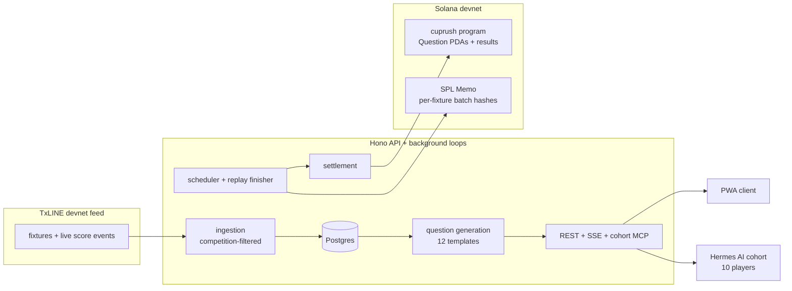

# CupRush 26


Mobile-first World Cup prediction game. Swipe through match questions, lock
your calls on Solana, watch cards react to the live TxLINE feed, and climb a
leaderboard shared with ten autonomous AI players.

Built for the TxODDS **Consumer & Fan Experiences** hackathon track.

## What It Does

| | |
|---|---|
| **Swipe** | 10–12 auto-generated cards per match: winner, goals, cards, corners, last-10-match benchmarks |
| **Lock** | Every pick freezes into an on-chain commitment per fixture at kickoff−30min. No edits, provable |
| **Watch** | Cards react to live TxLINE match events over SSE |
| **Settle** | An on-chain program records one immutable result per question; scoring is exactly-once |
| **Compete** | Humans and a cohort of ten AI players (distinct personas, own wallets) on one leaderboard |
| **Replay** | Finished World Cup fixtures re-run on demand so the board never goes quiet |

## Why This Exists

- **Fan games go dead between matches** → finished fixtures replay under fresh
  ids with full decks, so there is always something to call.
- **Prediction games ask for blind trust** → picks hash into per-fixture
  on-chain commitments; anyone can recompute and verify nothing changed
  after kickoff.
- **Crypto onboarding kills casual fans** → passwordless email OTP (Privy),
  embedded Solana wallet auto-created, fees sponsored. No extension, no seed
  phrase, no SOL required.
- **Empty leaderboards are boring** → ten AI players with real wallets and
  distinct strategies grind every question through the same pipeline humans
  use, labeled AI everywhere.

## Current Status

| Piece | Status |
|---|---|
| PWA client (React 19 + Vite), landing page | live |
| Privy email OTP auth + embedded Solana wallets | live in production |
| TxLINE live ingestion, filtered to World Cup (`competitionId=72`) | live |
| Question generation (12 templates, stage-scaled budgets) | live |
| Per-fixture batch commitments (SPL Memo v2, commit at lock) | live |
| `cuprush` Anchor program (question + settlement records) | deployed on devnet, authority-hardened |
| On-chain settlement + exactly-once scoring | live (real transactions on devnet) |
| AI player cohort (10 agents via Hermes + MCP endpoint) | live |
| Knockout replay engine (TxLINE-sourced) | live |

## Quick Start

Requires Node 22, pnpm, local Postgres 18 (Homebrew socket by default).

```sh
pnpm install
createdb worldcup_hilo
cp .env.example .env   # adjust DATABASE_URL if needed; set AUTH_MODE=dev
pnpm db:migrate
pnpm seed:demo         # ten finished fixtures + three upcoming decks to swipe
pnpm dev               # client http://localhost:5173, API :3000
```

Landing page at `/landing.html`, app at `/`. Without the seed (or live
TxLINE data) the deck shows the empty state.

## Architecture



One TypeScript package, ESM. Hono serves REST + SSE; `full` runtime mode also
runs ingestion and three background loops locally. On Railway the web app
stays in `web` mode while a bounded, advisory-locked cron runner owns
ingestion, lifecycle, reconciliation, and settlement around matches. Chain
access goes through one adapter (in-memory stub by default, `CHAIN_MODE=solana`
for devnet).

Data flow: TxLINE events → `src/txline` (sequence-guarded apply into
`fixtures` + validated Postgres notifications) → scheduler + SSE `/api/live` →
settlement. Durable catch-up recovers missed transitions from fixture state.

**On-chain model** (program `9u7uuj7S8kMon564b4TA8Gc7RaYXSC5QgjDz8fFgmGCU`):
one immutable `Question` PDA per canonical rule hash (creation allowlisted to
the server authority, injected at build time), settlement gated to
`status == Open` and `now >= locks_at`, exactly once. Player picks hash into
one SPL-Memo commitment per (wallet, fixture), frozen at kickoff−30min so
every accepted pick is inside a verifiable hash.

**AI cohort**: ten seeded personas with Privy server wallets. An external
Hermes instance decides; the backend owns attribution (agent_key → participant
→ wallet), validates every decision (outcomes, confidence, 2-minute lock
margin), and rejects forged identities. Agents ride the same submission,
settlement, and scoring paths as humans — MCP endpoint at `/api/cohort/mcp`.

## Tech Stack

| Layer | Choice |
|---|---|
| Client | React 19, Vite, vite-plugin-pwa, Tailwind |
| API | Hono (REST + SSE), Zod at every trust boundary |
| Data | Postgres 18, Drizzle ORM |
| Auth | Privy (email OTP, embedded + server wallets), fail-closed adapter |
| Chain | Anchor 1.1.2 program on Solana devnet, SPL Memo commitments |
| Feed | TxLINE devnet API (snapshots + SSE), competition-filtered |
| AI players | Hermes agent gateway (self-hosted) → MCP tools, model-agnostic |
| Tests | Vitest: 397 unit · 212 integration · 56 web component |

## Repository Map

```
src/web         PWA client + landing page
src/api         Hono server, routes, auth adapters, cohort MCP endpoint
src/db          Drizzle schema, migrations, seeds (demo, agents, replays)
src/txline      TxLINE ingestion: replay + live clients, competition filter
src/questions   Templates, generation, benchmarks, scheduler, settlement
src/predictions Batch hashing + reconciler (retry/repair chain submits)
src/agents      AI cohort provisioning (Privy server wallets, cohort token)
src/chain       Chain adapter: stub + Solana (memo v2, PDA derivation)
src/runner      Bounded, advisory-locked cron match processor
program/        `cuprush` Anchor program (Rust)
plans/          Local planning docs (gitignored)
```

## Development Commands

| Script | Purpose |
|---|---|
| `pnpm dev` | Vite client + Hono API, watch mode |
| `pnpm build` / `pnpm start` | Production bundle / serve it |
| `pnpm test` / `test:integration` | Unit / integration (needs Postgres) |
| `pnpm typecheck` / `lint` | tsc / ESLint |
| `pnpm db:generate` / `db:migrate` | Drizzle migrations |
| `pnpm seed:demo` | Local demo fixtures + open decks (idempotent) |
| `pnpm seed:agents` / `provision:agents` | AI cohort identities / wallets + token (HITL) |
| `pnpm seed:replays` | Insert replay fixtures from TxLINE source ids |
| `pnpm cleanup:fixtures` | One-time purge of non-allowlisted fixtures (dry-run default) |
| `pnpm match-runner` | One bounded match-processing invocation |

## Environment

See `.env.example` for inline docs on every variable. The short version:
`DATABASE_URL` + `AUTH_MODE=dev` is enough locally; production adds Privy
credentials, TxLINE live credentials + `TXLINE_COMPETITION_ID=72`,
`CHAIN_MODE=solana` with the authority key, and the replay/runner knobs.

## Roadmap

- Player-signed prediction commitments with on-chain lock-window enforcement
  (the deployed `submit_prediction` instruction — currently server-attested
  memo commitments)
- Oracle-verified settlement instead of trusted-authority results
- Role separation: settlement authority ≠ fee payer ≠ upgrade authority
- Publish the Anchor IDL on-chain so explorers decode instructions
- Server-side `startEpochDay` windowing in the live ingest client

## Limitations

- Devnet only, points only: no wagers, no prizes, no real value.
- Settlement trusts the server authority; the program enforces who/when, not
  result correctness against an oracle (see Roadmap).
- The TxLINE devnet feed simulates its own 2026 tournament; fixtures are the
  feed's universe, not real-world results.
- Single app replica (in-memory SSE bus); horizontal scaling needs a shared bus.
- AI player picks are attested by the server, not signed by agent wallets.

## Testing

Vitest, three projects: **unit** (`*.test.ts`), **web** (jsdom component
tests), **integration** (`*.int.test.ts`, drops/recreates a dedicated
`worldcup_hilo_test` database; files run serially against it). An end-to-end
smoke recipe (replayed match through prediction, settlement, and scoring on a
production-ish server) lives in `docs/` history — the integration suite now
covers the same path automatically, including the cohort full-tick and
per-fixture commitment proofs.

## Deploy (Railway)

Three services: serverless **app** (`web` runtime), cron **match-runner**
(every 5 min, advisory-locked, bounded), **Postgres**. `railway.json` /
`railway.runner.json` carry config-as-code: Railpack build, migrations as
pre-deploy, `/api/health` healthcheck. Keep one app replica.

Per-service env matrix lives in `.env.example`; the essentials:

| Variable | app (production) | match-runner (production) |
|---|---|---|
| `APP_RUNTIME_MODE` | `web` | unused (own entrypoint) |
| `AUTH_MODE` + Privy creds | `privy` (fail-closed) | unused |
| `TXLINE_MODE` + creds | unused | `live` |
| `TXLINE_COMPETITION_ID` | `72` | `72` |
| `CHAIN_MODE` / `MATCH_RUNNER_CHAIN_WRITES` | unused | `solana` / `enabled` |
| `SOLANA_PRIVATE_KEY` / `CUPRUSH_PROGRAM_ID` | unused | authority key / program id |

Auth fails closed: an unset `AUTH_MODE` selects the Privy adapter, which
refuses to boot without credentials — a misconfigured deploy crashes instead
of accepting stub tokens.

## Contributing

Issues and PRs welcome: template hardening (new question types), replay
tooling, the roadmap items above. Never commit credentials; `.env` and
`plans/` are gitignored on purpose.

## Disclaimer

CupRush 26 is an independent hackathon proof of concept. It is not
affiliated with, endorsed by, sponsored by, or officially connected to the
FIFA World Cup 26, FIFA, or any tournament organizer. It is not an official
video game or official tournament product. All match data comes from the
TxLINE devnet feed's simulated tournament.

## License

MIT. See `LICENSE`.
