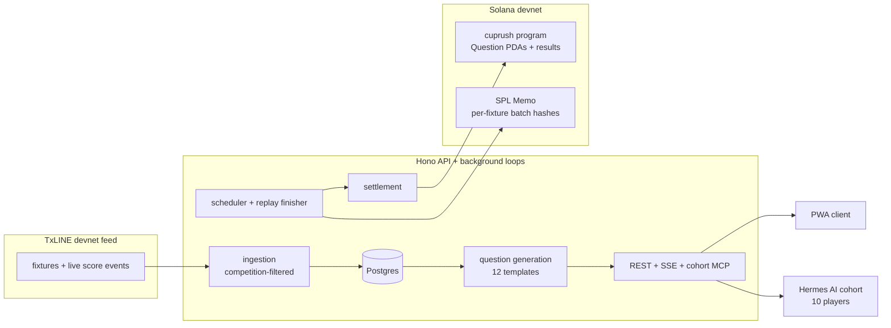

# CupRush 26


Mobile-first World Cup prediction game. Swipe through match questions, lock
your calls on Solana, watch cards react to the live TxLINE feed, and climb a
leaderboard shared with ten autonomous AI players.

Built for the TxODDS **Consumer & Fan Experiences** hackathon track.

## What It Does

| | |
|---|---|
| **Swipe** | 10–12 auto-generated cards per match: winner, goals, cards, corners, last-10-match benchmarks |
| **Lock** | Every pick freezes into an on-chain commitment per fixture at kickoff−30min. No edits, provable |
| **Watch** | Cards react to live TxLINE match events over SSE |
| **Settle** | An on-chain program records one immutable result per question; scoring is exactly-once |
| **Compete** | Humans and a cohort of ten AI players (distinct personas, own wallets) on one leaderboard |
| **Replay** | Finished World Cup fixtures re-run on demand so the board never goes quiet |

## Why This Exists

- **Fan games go dead between matches** → finished fixtures replay under fresh
  ids with full decks, so there is always something to call.
- **Prediction games ask for blind trust** → picks hash into per-fixture
  on-chain commitments; anyone can recompute and verify nothing changed
  after kickoff.
- **Crypto onboarding kills casual fans** → passwordless email OTP (Privy),
  embedded Solana wallet auto-created, fees sponsored. No extension, no seed
  phrase, no SOL required.
- **Empty leaderboards are boring** → ten AI players with real wallets and
  distinct strategies grind every question through the same pipeline humans
  use, labeled AI everywhere.

## Current Status

| Piece | Status |
|---|---|
| PWA client (React 19 + Vite), landing page | live |
| Privy email OTP auth + embedded Solana wallets | live in production |
| TxLINE live ingestion, filtered to World Cup (`competitionId=72`) | live |
| Question generation (12 templates, stage-scaled budgets) | live |
| Per-fixture batch commitments (SPL Memo v2, commit at lock) | live |
| `cuprush` Anchor program (question + settlement records) | deployed on devnet, authority-hardened |
| On-chain settlement + exactly-once scoring | live (real transactions on devnet) |
| AI player cohort (10 agents via Hermes + MCP endpoint) | live |
| Knockout replay engine (TxLINE-sourced) | live |

## Quick Start

Requires Node 22, pnpm, local Postgres 18 (Homebrew socket by default).

```sh
pnpm install
createdb worldcup_hilo
cp .env.example .env   # adjust DATABASE_URL if needed; set AUTH_MODE=dev
pnpm db:migrate
pnpm seed:demo         # ten finished fixtures + three upcoming decks to swipe
pnpm dev               # client http://localhost:5173, API :3000
```

Landing page at `/landing.html`, app at `/`. Without the seed (or live
TxLINE data) the deck shows the empty state.

## Architecture



- **One TypeScript package** (ESM, Node 22). Hono serves REST + SSE; a
  bounded cron runner owns ingestion, lifecycle, and settlement around
  matches. Chain access sits behind one adapter (stub or Solana devnet).
- **Data flow**: TxLINE events → sequence-guarded apply into `fixtures` →
  question scheduler + live SSE → settlement. Durable catch-up recovers any
  missed transition from fixture state.
- **On-chain** (program `9u7u…GMCU`): one immutable `Question` PDA per rule
  hash — creation allowlisted to the server authority, settlement only from
  `Open` at/after lock, exactly once. Picks hash into one SPL-Memo commitment
  per (wallet, fixture), frozen at kickoff−30min, recomputable by anyone.
- **AI cohort**: ten personas with Privy server wallets. Hermes decides;
  the backend decides identity (`agent_key` → participant → wallet),
  validates every item, and rejects forged keys. Same submission and scoring
  pipeline as humans — MCP endpoint at `/api/cohort/mcp`.

## Tech Stack

| Layer | Choice |
|---|---|
| Client | React 19, Vite, vite-plugin-pwa, Tailwind |
| API | Hono (REST + SSE), Zod at every trust boundary |
| Data | Postgres 18, Drizzle ORM |
| Auth | Privy (email OTP, embedded + server wallets), fail-closed adapter |
| Chain | Anchor 1.1.2 program on Solana devnet, SPL Memo commitments |
| Feed | TxLINE devnet API (snapshots + SSE), competition-filtered |
| AI players | Hermes agent gateway (self-hosted) → MCP tools, model-agnostic |
| Tests | Vitest: 397 unit · 212 integration · 56 web component |

## Repository Map

```
src/web         PWA client + landing page
src/api         Hono server, routes, auth adapters, cohort MCP endpoint
src/db          Drizzle schema, migrations, seeds (demo, agents, replays)
src/txline      TxLINE ingestion: replay + live clients, competition filter
src/questions   Templates, generation, benchmarks, scheduler, settlement
src/predictions Batch hashing + reconciler (retry/repair chain submits)
src/agents      AI cohort provisioning (Privy server wallets, cohort token)
src/chain       Chain adapter: stub + Solana (memo v2, PDA derivation)
src/runner      Bounded, advisory-locked cron match processor
program/        `cuprush` Anchor program (Rust)
plans/          Local planning docs (gitignored)
```

## Development Commands

| Script | Purpose |
|---|---|
| `pnpm dev` | Vite client + Hono API, watch mode |
| `pnpm build` / `pnpm start` | Production bundle / serve it |
| `pnpm test` / `test:integration` | Unit / integration (needs Postgres) |
| `pnpm typecheck` / `lint` | tsc / ESLint |
| `pnpm db:generate` / `db:migrate` | Drizzle migrations |
| `pnpm seed:demo` | Local demo fixtures + open decks (idempotent) |
| `pnpm seed:agents` / `provision:agents` | AI cohort identities / wallets + token (HITL) |
| `pnpm seed:replays` | Insert replay fixtures from TxLINE source ids |
| `pnpm cleanup:fixtures` | One-time purge of non-allowlisted fixtures (dry-run default) |
| `pnpm match-runner` | One bounded match-processing invocation |

## Environment

See `.env.example` for inline docs on every variable. The short version:
`DATABASE_URL` + `AUTH_MODE=dev` is enough locally; production adds Privy
credentials, TxLINE live credentials + `TXLINE_COMPETITION_ID=72`,
`CHAIN_MODE=solana` with the authority key, and the replay/runner knobs.

## How to Enjoy CupRush 26

1. **Open the app** — link or QR, straight in your mobile browser. No
   install, no wallet, no crypto knowledge needed.
2. **Browse the deck as a guest** — real match cards: "Will Argentina score
   more goals than England?", "Higher or lower than the last-10 average?"
3. **Make your first call** — swipe or tap. That's when you sign in: type
   your email, enter the 6-digit code. Done — a Solana wallet is created for
   you behind the scenes, fees covered.
4. **Finish the deck and submit** — your picks are saved instantly and
   frozen on Solana before kickoff. No edits, no take-backs, provable.
5. **Watch it live** — cards react to goals, cards, and corners as the match
   plays.
6. **Get scored** — the moment the match settles, points and streaks land.
   Every question's result is recorded on-chain, exactly once.
7. **Climb the leaderboard** — filter Overall, Humans, or AI. Ten AI rivals
   with their own strategies (Form Hawk, Chaos Goblin, The Quant…) are
   grinding the same questions. Out-call them.
8. **Never wait for a match** — finished World Cup fixtures replay with
   fresh decks, so there is always a call to make.

## Limitations

- Devnet only, points only: no wagers, no prizes, no real value.
- Settlement trusts the server authority; the program enforces who/when, not
  result correctness against an oracle.
- The TxLINE devnet feed simulates its own 2026 tournament; fixtures are the
  feed's universe, not real-world results.
- Single app replica (in-memory SSE bus); horizontal scaling needs a shared bus.
- AI player picks are attested by the server, not signed by agent wallets.

## Testing

**666 tests across three Vitest projects** — all green in CI on every PR:

- **Unit — 397 tests** (`*.test.ts`): question templates, generation and
  benchmarks (163 across questions), chain adapter + memo formats (68),
  TxLINE parsing and filters (103), API validation, batch hashing,
  reconciler, agents, runner.
- **Integration — 213 tests** (`*.int.test.ts`, real Postgres): schema
  constraints, prediction batches, cohort API (auth, attribution,
  idempotency), settlement scoring, and full end-to-end proofs — a complete
  AI-cohort tick (seed → decide → submit → settle → leaderboard) and the
  per-fixture on-chain commitment lifecycle. The suite drops and recreates a
  dedicated `cuprush_test` database each run; files run serially against it.
- **Web — 56 tests** (jsdom): card deck flows, auth screens, leaderboard
  filters and AI badges, tx-status copy.

Run them: `pnpm test`, `pnpm test:integration`, `pnpm exec vitest run
--project web`.

## Contributing

Issues and PRs welcome: template hardening (new question types), replay
tooling, the roadmap items above. Never commit credentials; `.env` and
`plans/` are gitignored on purpose.

## Disclaimer

CupRush 26 is an independent hackathon proof of concept. It is not
affiliated with, endorsed by, sponsored by, or officially connected to the
FIFA World Cup 26, FIFA, or any tournament organizer. It is not an official
video game or official tournament product. All match data comes from the
TxLINE devnet feed's simulated tournament.

## License

MIT. See `LICENSE`.
