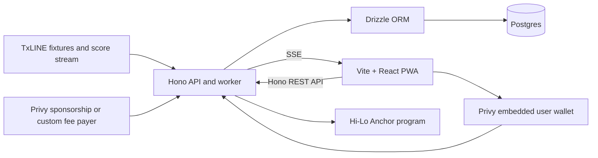

# World Cup Hi-Lo
## PoC product and architecture brief

**Track:** [Consumer and Fan Experiences](https://superteam.fun/earn/listing/consumer-and-fan-experiences) by TxODDS  
**Submission deadline:** July 19, 2026 at 23:59 UTC  
**Team:** Up to three people  
**Status:** PoC scope, updated July 2, 2026

## Delivery ownership

- **`[HERMES-BUILD]`** Hermes implements code, migrations, tests, scripts, and documentation.
- **`[HITL]`** A human supplies credentials, approves auth or user-data changes, funds services, performs live verification, deploys, and submits the entry.
- When both are required, HITL performs the named gate and Hermes continues after approval.

## Product decision

World Cup Hi-Lo is a mobile-first game where fans predict the match winner, then answer quick stat questions about goals, cards, and corners.

The app turns one simple prediction into a live second-screen experience. During the match, the card updates from TxLINE and shows how close the player is to winning.

This is a fan game, not a prediction market. The PoC has no deposits, wagers, tradable positions, or cash rewards.

### Why this scope

The track rewards accessibility, live responsiveness, originality, commercial potential, and complete execution. It explicitly values quality over scope.

The strongest submission is therefore one polished loop:

1. Open the link.
2. Understand the question immediately.
3. Choose an outcome.
4. Save the prediction through Solana.
5. Watch the card react to live match events.
6. Receive a result and move on the leaderboard.

### PoC boundaries

**Ship:**

- Match winner as the primary question for every fixture.
- Goals, yellow cards, red cards, and corners as secondary questions.
- One to four cards per fixture, based on tournament stage.
- Yes, No, Higher, Lower, and Push outcomes.
- Live TxLINE updates.
- A score, streak, and small leaderboard.
- On-chain question rules, one commitment per answer, and TxLINE-backed settlement.
- A deployed app, public repository, and demo video.

**Do not ship yet:**

- Cash prizes, tokens, or wagering.
- Sports or stats outside TxLINE's verified soccer feed.
- Leagues, badges, streak shields, or an item economy.
- Push notifications or native app wrappers.
- Redis, BullMQ, WebSockets, or microservices.
- On-chain points or leaderboard state.

---

## Priority 1: Gamification system

### Core loop

Every fixture starts with one primary card:

> Will Argentina score more goals than Spain?  
> Yes · No

Randomize which team appears first with the same stable fixture-based seed used for secondary questions.

The app then adds secondary stat cards as the tournament schedule shrinks. This keeps the game replayable without flooding the fan during the group stage.

Secondary questions use either the current fixture or a completed fixture as the benchmark.

> Previous match: 11 total corners  
> Will the next match finish Higher or Lower?

The player chooses, follows the live comparison during the match, and receives the result after the fixture reaches a terminal state.

If the totals match, the question is a **Push**. A Push preserves the streak but awards no point.

### Question inventory

TxLINE's verified soccer feed directly supports each participant's total goals, yellow cards, red cards, and corners. Match winner is derived from the two final goal totals.

| Tier | Example | Validation shape |
|---|---|---|
| Primary | Will Team A score more goals than Team B? | Subtract + GreaterThan 0 |
| Intra-fixture | Will Team A have more corners than Team B? | One two-stat proof |
| Intra-fixture | Will second-half corners beat first-half corners? | One two-stat proof using period keys |
| Inter-fixture | Will this match beat the previous match's corner total? | Add both teams per fixture + proven benchmark |
| Inter-fixture | Will Team A score more than Team A did last match? | Proven benchmark + new fixture proof |
| Intra-fixture | Will Argentina score exactly two more goals than Spain? | Subtract + Equal 2 |

TxLINE's two-stat validation accepts one fixture and two stat keys. It supports intra-fixture comparisons only.

An inter-fixture question must first anchor a proven value from one fixture, then validate the second fixture against that stored benchmark. Do not describe this as one two-stat proof.

### Question rotation

Use deterministic templates, not AI, to generate questions:

1. Create the winner card for every scheduled fixture.
2. Prefer live-friendly corners and goals for the first secondary card.
3. Add yellow-card questions when the matchup has a clear benchmark.
4. Use red cards sparingly because most questions would have a zero benchmark.
5. Stop at four cards per fixture.

This adds variety while keeping every question explainable and settleable.

| Tournament stage | Question budget per fixture |
|---|---|
| Group stage | 1 winner + 1 secondary |
| Early knockout rounds | 1 winner + 2 secondary |
| Semifinals and final | 1 winner + 3 secondary |

### LLM-assisted question selection

A small LLM selects the operator, predicate, and wording when questions are created six hours before kickoff. It never decides whether a prediction won.

The model may choose only from a registry of verified templates. Its Zod schema restricts stat keys, operators, comparisons, thresholds, and question types to values the program supports.

The service then performs semantic checks. It rejects missing fixtures, unsupported periods, unavailable benchmarks, mismatched team order, and rule combinations outside the selected template.

Randomize team order with a stable seed derived from the fixture and template IDs. Retries must produce the same team order and on-chain rule.

Example:

> Will Argentina score exactly two more goals than Spain?

This maps to `ArgentinaGoals - SpainGoals == 2`. The randomized team always becomes `stat1`; the opponent becomes `stat2`.

#### Non-blocking fallback

Question creation runs in the background, never during a user's swipe.

1. Call the LLM with a short timeout and structured output.
2. Validate the response with Zod and the template registry.
3. If it times out, fails, or returns an invalid rule, use a deterministic template selected from the fixture ID.
4. If an inter-fixture benchmark is unavailable, use a supported intra-fixture template.
5. Always create the match-winner question without the LLM.

Use one retry before the question opens. Log latency, model, token usage, validation errors, and whether the fallback ran.

### Question lifecycle

| State | Time | Behaviour |
|---|---|---|
| Scheduled | Before kickoff − 6 hours | Prepare templates and benchmarks |
| Open | Kickoff − 6 hours to kickoff − 30 minutes | Accept one immutable choice per user |
| Locked | Final 30 minutes before kickoff | Show choices; accept no new predictions |
| Live | Kickoff until a terminal match state | Stream TxLINE odds and stats; show the user's locked choice |
| Settling | Terminal match state until on-chain confirmation | Validate the result and submit settlement |
| Settled | Within 30 minutes of the terminal state | Show result, points, streak, and proof |
| Void | Postponed, cancelled, or abandoned | Award no point and preserve the streak |

A one-minute scheduler advances questions from Scheduled to Open and Open to Locked. TxLINE match events drive Live, Settling, Settled, and Void.

The open and lock timestamps are stored both in Postgres and the Question PDA. The on-chain program enforces both independently.

### MVP mechanics

| Mechanic | Rule | Purpose |
|---|---|---|
| Score | +1 for a correct prediction | Immediate progress |
| Streak | Consecutive correct predictions | A simple reason to return |
| Leaderboard | Total correct, then longest streak | Light competition |
| Share card | Result, streak, and next challenge | Organic distribution |

Keep the scoring fixed. Multipliers and currencies add explanation without improving the core experience.

### Live match state

After kickoff, each prediction card becomes a live progress card:

- Current score or stat total versus the selected outcome.
- Match minute and state.
- A clear "currently winning" or "currently losing" state.
- A small animation only when the relevant score or stat changes.

This is the product's most important demo moment. It proves that TxLINE drives the experience instead of merely supplying a final result.

### AI pundit

Treat the AI pundit as a stretch feature, not part of the critical path.

If time remains, generate one shared opinion per question. Cache it for every user and validate the model's structured response before displaying it.

Do not call an LLM for every swipe or live event. The game must remain useful when the AI feature is unavailable.

### Commercial path

The cleanest monetization path avoids wagering:

- Sponsor-branded match challenges.
- White-label supporter games for clubs and broadcasters.
- Premium private leagues after the hackathon.

For the PoC, show one tasteful sponsor slot on the result or share card. Do not build billing.

---

## Priority 2: Frictionless onboarding

### Target journey

1. The fan opens a shared link or QR code.
2. The first card explains itself without a tutorial.
3. The fan can drag the card before signing in.
4. On release, the app asks them to save the prediction.
5. The fan authenticates with an email one-time code.
6. An embedded Solana wallet is created or unlocked behind the account.
7. The app requests one clear approval for delegated play.
8. The app sponsors the transaction fee and confirms the lock.

Fans may browse and try the card as guests. Authentication becomes mandatory only when they save their first prediction.

The wallet stays invisible during normal play, but the app must disclose that it creates a wallet and may submit approved game transactions. Invisible UX must not mean hidden authority.

### UX rules

- No seed phrase in the primary flow.
- No SOL balance requirement.
- No wallet jargon on the first screen.
- No authentication wall before the fan sees and tries a question.
- No mandatory PWA installation.
- No notification permission prompt during onboarding.
- One sentence per decision.

Suggested copy:

- Card: **Will this match beat 11 corners?**
- Actions: **Higher** and **Lower**.
- Save prompt: **Save your pick and start a streak.**
- Confirmation: **Locked on Solana.**

### Authentication and identity

Use Privy's passwordless email login. It verifies the one-time code, creates a stable user ID, and issues the session token used by the backend.

The backend maps the Privy user ID to a human `participant`, which owns the wallet address, game profile, predictions, and leaderboard counters. It verifies the Privy access token on every authenticated request.

Do not store OTPs. Avoid storing raw email addresses unless the product needs them; use the Privy user ID as the internal identity.

Phone login, account recovery beyond email OTP, and login-method linking are post-hackathon work.

Keep account actions explicit and small:

- `POST /api/logout` clears the app session and calls Privy logout.
- `POST /api/wallet/delegation/revoke` removes server signing authority.
- `DELETE /api/me` revokes delegation and anonymizes the off-chain profile.

Deletion cannot erase existing Solana transactions. Tell the user before confirmation and remove only data the application controls.

Authentication and user-data handling require manual human review before release.

### Wallet choice

Use Privy embedded Solana wallets for the PoC. Privy supports delegated server access and sponsored Solana transactions, which covers the required invisible play flow without custom key custody.

The user approves delegation once. The backend may then submit only the game's allowlisted instructions under a narrow policy. Provide a visible wallet address and a way to revoke delegation.

If embedded wallet integration blocks the core demo, fall back to a standard Solana wallet connection. This reduces mainstream accessibility, so present it as a fallback only.

### Accessibility baseline

- Buttons remain available alongside swipe gestures.
- Higher and Lower never rely on colour alone.
- Motion respects `prefers-reduced-motion`.
- Touch targets meet mobile sizing expectations.
- The full prediction flow works with a keyboard.

---

## Priority 3: Tech stack and architecture

### Minimal stack

| Layer | Choice | Reason |
|---|---|---|
| Client | Vite + React + `vite-plugin-pwa` | Small mobile-first PWA build |
| Service | Hono on Node.js | REST, SSE relay, TxLINE ingestion, and settlement in one process |
| Database | Postgres + Drizzle ORM | Typed schema and migrations without a heavy data layer |
| Validation | Zod + Hono Zod Validator | Validate API, TxLINE, and AI payloads at their boundaries |
| Authentication | Privy email OTP | Passwordless identity and session tokens |
| Chain | One small Anchor program | Prediction commitments and selected proven results |
| Live client updates | Server-Sent Events | Same one-way model as TxLINE; browser reconnects automatically |
| Wallet | Privy embedded wallet + sponsorship | Delegated signing with sponsored Solana fees |
| AI | Small OpenRouter model | Background question selection with deterministic fallback |
| Network | Solana mainnet + TxLINE level 12 | Matching cluster and real-time World Cup updates |

Do not add Redis for the PoC. One process can hold current fixture state in memory, while Postgres retains anything that must survive a restart.

Use one TypeScript package, one lockfile, and one deployment. Vite runs the client during development; Hono serves the built PWA and API in production.

```text
src/
  web/       React PWA
  api/       Hono routes, TxLINE stream, settlement loop
  db/        Drizzle schema and queries
```

Do not add a monorepo tool, separate worker service, repository layer, or dependency-injection container.

### Runtime shape



The backend owns the TxLINE credentials and maintains one authenticated stream. Browsers never receive the TxLINE token.

The service validates and normalizes external payloads before storing or relaying them.

The later Hermes cohort reuses this Hono service through a restricted MCP endpoint. Do not deploy a separate agent backend; the existing submission, sponsorship, settlement, and scoring paths already provide the required boundary.

### Data flow

1. The service loads fixtures and completed benchmarks from TxLINE.
2. It creates one winner question and the stage-appropriate stat questions.
3. The fan authenticates with email OTP before the first saved answer.
4. The fan submits an outcome before the question locks.
5. The embedded wallet signs directly or through approved delegation.
6. The backend validates the instruction and asks the sponsorship layer to add the fee payer.
7. TxLINE score events update the live card through the service's SSE endpoint.
8. A terminal fixture state triggers settlement.
9. The service updates points and the leaderboard.

### Database schema

#### Participant and user entities

`participants` owns game identity for both humans and future AI players. `users` contains only human authentication identity and points to one participant. This small split avoids changing prediction ownership when the Hermes cohort is added.

Privy owns credentials and OTP verification. The application stores its stable user ID, not a duplicated email record.

| Column | Type | Rule |
|---|---|---|
| `participants.id` | UUID | Primary key generated by Postgres |
| `participants.kind` | Enum | `human` now; `agent` reserved for the follow-up |
| `participants.wallet_address` | Varchar(44) | Unique; nullable until wallet creation succeeds |
| `participants.display_name` | Varchar(32) | Optional leaderboard name |
| `participants.points` | Integer | Non-negative cached total |
| `participants.current_streak` | Integer | Non-negative cached streak |
| `participants.best_streak` | Integer | Non-negative cached maximum |
| `users.id` | UUID | Primary key generated by Postgres |
| `users.participant_id` | UUID | Required and unique foreign key |
| `users.privy_user_id` | Text | Required and unique |

```ts
import { sql } from "drizzle-orm";
import {
  check,
  integer,
  pgEnum,
  pgTable,
  text,
  timestamp,
  uuid,
  varchar,
} from "drizzle-orm/pg-core";

export const participantKind = pgEnum("participant_kind", ["human", "agent"]);

export const participants = pgTable(
  "participants",
  {
    id: uuid("id").defaultRandom().primaryKey(),
    kind: participantKind("kind").notNull(),
    walletAddress: varchar("wallet_address", { length: 44 }).unique(),
    displayName: varchar("display_name", { length: 32 }),
    points: integer("points").notNull().default(0),
    currentStreak: integer("current_streak").notNull().default(0),
    bestStreak: integer("best_streak").notNull().default(0),
    createdAt: timestamp("created_at", { withTimezone: true })
      .notNull()
      .defaultNow(),
  },
  (participant) => [
    check("participants_points_nonnegative", sql`${participant.points} >= 0`),
    check(
      "participants_current_streak_nonnegative",
      sql`${participant.currentStreak} >= 0`,
    ),
    check(
      "participants_best_streak_nonnegative",
      sql`${participant.bestStreak} >= 0`,
    ),
  ],
);

export const users = pgTable(
  "users",
  {
    id: uuid("id").defaultRandom().primaryKey(),
    participantId: uuid("participant_id")
      .notNull()
      .unique()
      .references(() => participants.id),
    privyUserId: text("privy_user_id").notNull().unique(),
    createdAt: timestamp("created_at", { withTimezone: true })
      .notNull()
      .defaultNow(),
  },
);
```

`points` and streak fields are read-optimized counters, not the source of truth. Rebuild them from settled predictions if they drift.

Each prediction references `participants.id`. For human requests, derive the participant through the verified Privy access token. Never trust a participant ID from the request body.

The PoC needs only three user routes:

- `GET /api/me`
- `PATCH /api/me` for a schema-validated `displayName` only
- `GET /api/leaderboard`

Do not store OTPs, passwords, raw access tokens, or email addresses in the application database.

#### Core tables

Keep settlement state on `questions`; a separate settlement table adds no value for the PoC.

| Table | Required columns | Key constraints |
|---|---|---|
| `participants` | kind, wallet, display name, cached points and streaks | Wallet unique |
| `users` | participant, Privy user ID, created timestamp | Participant and Privy user ID unique |
| `fixtures` | `id`, teams, `starts_at`, `game_state`, `last_seq` | TxLINE fixture ID is primary key |
| `questions` | fixture IDs, template, stat keys, operator, comparison, threshold, lifecycle timestamps, status, result, retry fields | Unique canonical rule hash |
| `predictions` | participant, question, outcome, PDA, chain status, transaction signature, timestamps | Unique `(participant_id, question_id)` |

`fixtures.last_seq` is the durable TxLINE cursor. Accept an update only when its sequence is newer than the stored value.

`questions` stores `opens_at`, `locks_at`, `settled_at`, `attempt_count`, `next_retry_at`, and `last_error`. It also stores the on-chain Question PDA and settlement signature.

`predictions` stores `submitted_at`, `confirmed_at`, and `scored_at`. `scored_at` prevents the same settled prediction from changing points twice.

Use `ON DELETE RESTRICT` for `predictions.participant_id`. Account deletion anonymizes the participant and removes the user login row, but retains the participant-wallet link needed to reconcile its public predictions.

The database mirrors chain state for fast reads; it does not replace it. Question and prediction PDAs remain the public source for immutable rules and choices.

### On-chain scope

TxLINE proves sports data. It does not record what a player predicted or when they predicted it.

To make achievements independently verifiable, store the immutable question rule and each player's choice on-chain. Do not store question copy, team artwork, points, or leaderboard data.

The PoC needs two account types:

| Account | Stores |
|---|---|
| Question | Rule hash, fixture IDs, stat keys, operator, predicate, threshold or proven benchmark, `opens_at`, `locks_at`, result, and status |
| Prediction | Question, player wallet, selected outcome, submitted timestamp, resolved flag, and correctness |

The program needs three instructions:

- `create_question`
- `submit_prediction`
- `settle_question`

Use one Question PDA per generated question and one Prediction PDA per player wallet and question. PDA seeds enforce one immutable choice per player without storing a mapping.

Enforce `opens_at` and `locks_at` inside `submit_prediction`. Backend-only timing would allow early or late predictions from a custom client.

The Question PDA stores structured rule fields because the program needs them at settlement. The database stores the human-readable copy and duplicates the rule for fast rendering.

For an inter-fixture question, `create_question` validates the completed fixture with an Equal predicate and stores its proven value as the benchmark. `settle_question` validates the new fixture against it.

If the prior fixture proof is unavailable when questions open, choose an intra-fixture fallback. Do not create an unprovable inter-fixture question.

Prove one intra-fixture and one inter-fixture template end to end first. Reuse each proven question result for every user prediction; never call TxOracle per user.

Add a template to the production registry only after its TxOracle settlement test passes. If a template cannot settle through TxOracle, remove it instead of silently trusting the backend.

Match winner comes from the two final goal stats and a terminal match state. The TxLINE IDL supports Add, Subtract, Equal, GreaterThan, and LessThan.

Use those operations only through verified templates. If proof retrieval is delayed, keep the question in `settling` and retry; never invent or privately override the result.

### Idempotency, ordering, and recovery

The system writes the same intent to Postgres and Solana. Either write may succeed before the other, so every operation must be safe to retry.

#### Prediction submission

1. Insert a `pending` prediction using the unique `(participant_id, question_id)` constraint.
2. Build the PDA from the participant's wallet and question ID.
3. Submit the sponsored transaction.
4. Mark the row `confirmed` with its signature after chain confirmation.

If the request repeats, return the existing prediction. Do not create a second transaction or let the answer change.

If the process crashes after Solana succeeds but before Postgres updates, a reconciler checks the deterministic Prediction PDA and repairs the row.

If Postgres succeeds but Solana fails, keep the row `pending`. Retry with capped exponential backoff until the question locks, then mark it `failed`.

#### TxLINE event ordering

Validate every event, then compare its fixture sequence with `fixtures.last_seq` in one database transaction.

- Ignore a duplicate or older sequence.
- Apply a newer event and advance `last_seq` atomically.
- After reconnect, fetch a snapshot before resuming the stream.
- Send the current snapshot first when a browser reconnects.
- Use `fixtureId:seq` as the browser SSE event ID.

This keeps the UI correct after duplicated events, out-of-order delivery, process restarts, and browser reconnects.

#### Settlement and scoring

Move a question from `live` to `settling` with a conditional update. Only the process that changes that row submits the settlement transaction.

The Question PDA refuses a second settlement. A retry reads the existing on-chain result and repairs Postgres instead of submitting another result.

Score predictions in one Postgres transaction. Update only rows where `scored_at IS NULL`, increment the participant's cached counters, then set `scored_at`.

The one-minute Hono scheduler also scans pending predictions, settling questions, and overdue terminal fixtures. This replaces a queue for the PoC.

Expose delayed settlement in the UI. At 30 minutes after the terminal match state, alert the team and keep retrying; never invent a result to satisfy the deadline.

### Embedded wallet and gas infrastructure

Keep ownership, delegated authority, and fee payment separate:

| Component | Owner | Purpose |
|---|---|---|
| Embedded user wallet | User account through Privy | Owns the prediction and supplies the user signature |
| Delegated server signer | Application, after user approval | Submits allowlisted game actions |
| Fee payer | Privy sponsorship or application backend | Pays fees for approved game transactions |

On Solana this is a sponsored fee payer, not an Ethereum-style paymaster. The user wallet still authorizes the action; the app wallet only pays and broadcasts.

#### Managed transaction flow

1. The user authenticates with email OTP.
2. Privy creates or restores the user's embedded Solana wallet.
3. The user approves limited delegation for game actions.
4. The backend builds the transaction from a known game template.
5. The sponsor path decodes and validates the complete message.
6. It accepts only the Hi-Lo program and expected instruction shape.
7. Privy sponsorship adds the fee payer and broadcasts the transaction.
8. The client receives the signature and confirmation state.

The backend must never sign an opaque transaction merely because it came from an authenticated user.

Prefer Privy's native Solana sponsorship with app gas credits. Use a custom backend fee-payer wallet only if the native path fails the Day-1 spike.

#### Sponsorship guardrails

- Allowlist the Hi-Lo program ID and supported instructions.
- Reject SOL transfers, token transfers, and unexpected account creation.
- Limit submissions per wallet, question, session, and IP.
- Cap compute units and sponsored spend per transaction.
- Prevent repeated associated-token-account creation and closure.
- If using a custom fee payer, keep its key in a secret manager or managed wallet service.
- Log the wallet, question, instruction, fee, and transaction signature.

#### Funding decision

For the custom path, fund one capped fee-payer wallet with mainnet SOL. Users need no SOL balance while sponsorship is active.

If Privy manages sponsorship through app credits, fund that account instead of operating a fee-payer key.

Do not send 0.1 SOL to every embedded wallet. It creates a drainable faucet and funds far more transactions than the game needs.

Do not fall back to prefunding user wallets on mainnet. If sponsorship is unavailable, show a maintenance state and restore service after the sponsor is funded.

Use devnet only for isolated contract tests. The live demo uses mainnet end to end so TxLINE level 12, TxOracle roots, and the Hi-Lo program share one cluster.

USDC cannot pay native Solana fees through Privy's current user-pays mode; that mode is EVM-only. A USDC credit or conversion system is post-hackathon scope.

Require manual security review before enabling delegated signing or sponsorship on mainnet.

### Test strategy

Use Vitest for unit and integration tests. Add Cypress only after the core flow is stable; it is not required for the PoC submission.

#### Unit tests

- Lifecycle boundaries at 6 hours, 30 minutes, kickoff, terminal state, and the settlement deadline.
- Each verified question template and its operator, predicate, threshold, and randomized team order.
- LLM schema rejection and deterministic fallback selection.
- Yes, No, Higher, Lower, Push, Void, points, and streak rules.
- TxLINE payload validation and sequence comparison.
- Sponsorship instruction allowlisting and spend limits.

#### Integration tests

- Hono authentication middleware with valid, expired, and missing Privy tokens.
- Drizzle migrations and database constraints against a dedicated Postgres test database.
- Duplicate prediction requests returning the same row and PDA.
- Crash recovery between database and Solana writes using a stubbed chain adapter.
- Duplicate and out-of-order TxLINE events advancing `last_seq` exactly once.
- Settlement retries and scoring updating a participant exactly once.
- SSE reconnect returning a snapshot followed by newer events.
- Logout, delegation revocation, and account deletion endpoints.

Run migrations before the integration suite and reset the test schema between files. Do not use SQLite; its constraints and transactions differ from Postgres.

Keep live mainnet checks outside CI. Run one manual smoke test for TxLINE level 12, sponsored signing, and settlement before recording the demo.

#### Later Cypress coverage

Add one browser journey: email login, embedded-wallet creation, prediction, lock, live update, settlement, and leaderboard change.

### Deliberate omissions

- No Config, Benchmark, or UserProfile PDA.
- No per-user oracle call.
- No on-chain points or leaderboard.
- No client WebSocket connection.
- No separate worker service or job queue.
- No horizontal scaling.
- No Hermes runtime, agent tables, or MCP endpoint in the current PoC.

These omissions keep the PoC small without weakening the judged experience.

---

## Follow-up: Hermes AI player cohort

After the PoC, one Hermes instance can orchestrate ten independent AI players. The existing `participants` table, prediction ownership, settlement, scoring, and leaderboard paths already support them.

Add `agent_cohorts`, `agents`, and `agent_decisions`, then provision one Privy server wallet per agent. A scoped cohort token lets the Hermes parent relay validated decisions, while the backend binds each `agent_key` to its own participant and wallet.

Expose the two cohort MCP tools from the existing Hono service. A separate agent backend would duplicate wallet, submission, and security logic without adding isolation.

This feature is not part of the hackathon build. See the final [Hermes AI player implementation plan](./hermes-agent-plan.md).

---

## Judging strategy

The official listing names five criteria.

| Criterion | What the demo must prove |
|---|---|
| Fan Accessibility & UX | A non-crypto fan understands and submits a pick in seconds |
| Real-Time Responsiveness | A TxLINE goal, card, or corner event visibly changes the live card |
| Originality & Value Creation | The feed becomes a replayable social game, not a score clone |
| Commercial & Monetization Path | Sponsor challenges and white-label fan experiences are credible |
| Completeness & Execution | One full question works from choice through settlement |

The listing says judges will weigh the demo video heavily because live match activity may not exist during review.

### Five-minute demo outline

1. **Problem:** passive score apps do not give casual fans a simple action.
2. **First use:** open the link and swipe without wallet jargon.
3. **Solana moment:** save the prediction with sponsored gas.
4. **TxLINE moment:** replay a validated captured event and show the live card update.
5. **Resolution:** settle the question, update the streak, and show the share card.
6. **Business:** show the sponsor placement and white-label path.
7. **Technical proof:** name the exact TxLINE endpoints used.

Clearly label recorded-event replay as demo mode. The deployed app must also support the real live stream.

---

## Build order

### Day 1: prove the risky integrations

- `[HITL]` Activate TxLINE level 12 and provide the credentials.
- `[HERMES-BUILD]` Capture and schema-validate a real scores-stream payload.
- `[HITL]` Provide Privy credentials and approve the wallet and sponsorship setup.
- `[HERMES-BUILD]` Create one wallet, send one sponsored prediction, and test one intra-fixture and one inter-fixture settlement path.
- `[HERMES-BUILD]` Confirm Add, Subtract, Equal, GreaterThan, and LessThan through TxOracle.
- `[HITL]` Review all generated auth, user-data, delegation, and sponsorship code before it can ship.

### Days 2–4: complete the loop

- `[HERMES-BUILD]` Build the Vite, Hono, and Drizzle application in one package.
- `[HERMES-BUILD]` Apply migrations for `participants`, `users`, `fixtures`, `questions`, and `predictions`.
- `[HERMES-BUILD]` Build the swipe card, button fallback, winner card, and stat cards.
- `[HERMES-BUILD]` Add the LLM selector, schema validation, and deterministic fallback.
- `[HERMES-BUILD]` Relay live events and settle every supported outcome.
- `[HERMES-BUILD]` Add score, streak, leaderboard, and Vitest coverage.

### Days 5–7: polish the submission

- `[HERMES-BUILD]` Add onboarding, transaction states, the share card, and sponsor placement.
- `[HERMES-BUILD]` Test mobile, keyboard, reconnect, and reduced-motion flows.
- `[HERMES-BUILD]` Prepare deployment configuration, endpoint documentation, and the demo script.
- `[HITL]` Run the mainnet smoke test, approve the final security review, deploy, record the demo, make the repository public, and submit the entry.

Build the optional AI pundit only after the question-selection LLM and end-to-end flow are stable.

---

## Definition of done

- The deployed app works during a match.
- TxLINE level 12 supplies real-time mainnet input.
- A fan can complete the flow without owning SOL.
- Email OTP restores the same identity and wallet.
- Drizzle migrations create all five constrained core tables.
- The embedded wallet and delegation are disclosed once, then stay out of the way.
- The prediction is recorded through Solana.
- No prediction can be created or changed after `locks_at`.
- Live events update the card without refresh.
- Match-winner, intra-fixture, and inter-fixture questions settle correctly.
- Settlement normally confirms on-chain within 30 minutes of the terminal match state.
- Yes, No, Higher, Lower, Push, void, and reconnect paths behave correctly.
- Vitest unit and integration suites pass.
- The public repository includes setup instructions and TxLINE endpoints.
- The demo video is under five minutes and shows the full journey.
- The submission includes candid feedback about the TxLINE API.

---

## Risks to resolve early

| Risk | Decision |
|---|---|
| Scores-stream payload differs from the research | Capture and schema-validate a real event on Day 1 |
| TxOracle CPI fails for a template | Remove that template from the registry |
| Embedded wallet blocks progress | Fall back to a standard Solana wallet |
| OTP or session handling is weak | Let Privy verify OTPs; validate access tokens on the backend |
| LLM times out or returns an invalid rule | Use the deterministic verified-template fallback |
| Sponsorship endpoint is abused | Allowlist instructions and enforce spend limits |
| No live match during judging | Record a validated replay path in the demo |
| Match is postponed or abandoned | Void the question and preserve the streak |
| Question count grows | Apply the stage budget and cap each fixture at four cards |

---

## Submission requirements

The official listing requires:

- A functional live product, not a mockup.
- TxLINE data as a live input.
- Sign-up through Solana.
- A public repository.
- A demo video up to five minutes.
- A working application link or API endpoint.
- Brief technical documentation naming the TxLINE endpoints.
- Feedback on the TxLINE developer experience.

## Primary references

- [Consumer and Fan Experiences track](https://superteam.fun/earn/listing/consumer-and-fan-experiences)
- [TxLINE Quickstart](https://txline.txodds.com/documentation/quickstart)
- [TxLINE World Cup access](https://txline.txodds.com/documentation/worldcup)
- [TxLINE streaming examples](https://txline.txodds.com/documentation/examples/streaming-data)
- [TxLINE soccer feed](https://txline.txodds.com/documentation/scores/soccer-feed)
- [TxLINE on-chain validation](https://txline.txodds.com/documentation/examples/onchain-validation)
- [Privy: provisioning delegated signers](https://docs.privy.io/wallets/using-wallets/signers/delegate-wallet)
- [Privy email authentication](https://docs.privy.io/authentication/user-authentication/login-methods/email)
- [Privy: sponsoring Solana transactions](https://docs.privy.io/wallets/gas-and-asset-management/gas/solana)
- [Privy: gas payment modes](https://docs.privy.io/wallets/gas-and-asset-management/gas/setup)
- [Hono on Node.js](https://hono.dev/docs/getting-started/nodejs)
- [Hono streaming helpers](https://hono.dev/docs/helpers/streaming)
- [Drizzle with PostgreSQL](https://orm.drizzle.team/docs/get-started-postgresql)
- [Vite guide](https://vite.dev/guide/)
- [Vite PWA plugin](https://vite-pwa-org.netlify.app/)
- [Vitest guide](https://vitest.dev/guide/)
- [Cypress documentation](https://docs.cypress.io/app/get-started/why-cypress)
- [Solana account model](https://solana.com/docs/core/accounts)
- [Solana PDAs](https://solana.com/docs/core/pda)
